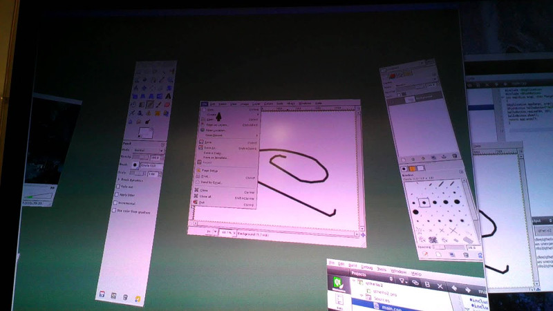

# About

This project was an exploration of VR desktops that started mid june 2012 in anticipation of the Oculus Rift, utilizing Razer Hydra for position tracking.

The source code was never released for this prototype but with the [announcement](https://www.collabora.com/news-and-blog/news-and-events/moving-the-linux-desktop-to-another-reality.html) of [xrdesktop](https://gitlab.freedesktop.org/xrdesktop/xrdesktop), a new project to develop a VR/AR linux desktop, I'm releasing this code as-is for general public use.

This is not a revival of this project but just a release of a piece of history with a bit of reconstruction (added openvr support) for those who would explore it.

# History

What many may not know is that a lot of the early discussions and development happened in the Meant to be Seen 3D (MTBS3D) forums. Including the Oculus Rift and VR ports of games such as Doom 3 and Jedi Knight.

* 2012 Apr 15 - Palmer Luckey announced he was going to launch a kickstarter for his Oculus Rift prototype. [1](https://www.mtbs3d.com/phpBB/viewtopic.php?f=140&t=14777)
* 2012 Jun 9  - Video shared of John Carmack and Rift Prototype. [2](https://www.youtube.com/watch?v=GVDXXfbz3QE)
* 2012 Jun 23 - I opened discussions on VR/AR Windows Desktop development and shared information on this project. [3](https://www.mtbs3d.com/phpbb/viewtopic.php?f=138&t=15088) [4](https://www.youtube.com/watch?v=XP0LLfiD43Y) [5](https://www.youtube.com/watch?v=w9EOzPY8R0w)
* 2012 Aug 1 - Oculus Kickstarter Campaign launched.
* 2012 Aug 15 - In the same forum druidsbane/hwahba started discussing their VR desktop implementation called [Ibex](http://hwahba.com/ibex) and sharing code.
* 2012 Aug 18 - In the same forum, a simplified version of this project was released that just did a flat VR desktop. [6](https://code.google.com/archive/p/vr-x-wrapper) [7](https://www.youtube.com/watch?v=WOVKjM0z3xI)
* 2013 Mar 29 - Oculus Rift DK1 released

# Notes

The code is very hacky, the project was never complete, it had a lot of bugs and I was trying figure out how to get X11 to work right, but in truth it was not designed to do what I was trying to do. In it's last state mouse doesn't work as well for some programs like Gimp. In the end I concluded that a better solution was to come up with an API, use shared textures, and use library injection of custom libraries to force applications to use opengl instead of x11.
